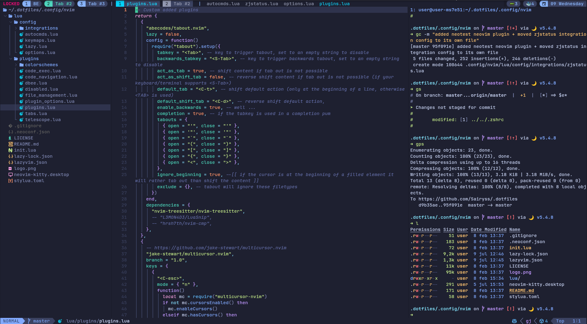

# Dotfiles

My configs, neovim/vscode plugins, tools for development.

### Configs

### Vim-like motions in your Desktop Environment

I remapped my keyboard to use specific hotkeys and Vim-like motions in my entire DE
using [kanata](https://github.com/jtroo/kanata). Check out the [readme](./.config/kanata/README.md) to find out more.

## List of tools

### Terminal tools

#### Shell

- [kitty](https://github.com/kovidgoyal/kitty) - terminal emulator
- [zsh](https://www.zsh.org/) - a Unix shell
- [oh-my-zsh](https://github.com/robbyrussell/oh-my-zsh) - zsh config with bells and whistles
- [zsh-syntax-highlighting](https://github.com/zsh-users/zsh-syntax-highlighting) - syntax highlighting for zsh
- [zsh-autosuggestions](https://github.com/zsh-users/zsh-autosuggestions) - autosuggestions for zsh
- [starship](https://starship.rs/) - shell prompt

#### Files

- [yazi](https://github.com/sxyazi/yazi) - terminal file manager
- [bat](https://github.com/sharkdp/bat) - same as `cat` but with syntax highlighting
- [eza](https://github.com/eza-community/eza) - same as `ls` but with syntax highlighting
- [zoxide](https://github.com/ajeetdsouza/zoxide) - quick access to files and directories
- [erdtree](https://github.com/solidiquis/erdtree) - better tree
- [broot](https://github.com/Canop/broot) - a better way to navigate directories

#### Git

- [git](https://github.com/git/git) - version control tool
- [tig](https://github.com/jonas/tig) - text-mode interface for git
- [scm_breeze](https://github.com/scmbreeze/scm_breeze) - a set of shell scripts that enhance your interaction with git
- [lazygit](https://github.com/kdheepak/lazygit.nvim) - terminal UI for git

#### Search

- [fzf](https://github.com/junegunn/fzf) - command-line fuzzy finder
- [ripgrep](https://github.com/BurntSushi/ripgrep) - `grep` alternative
- [fd](https://github.com/sharkdp/fd) - find files and folders. same as `find` but better

#### Http

- [curl](https://github.com/curl/curl) - command-line tool for transferring data specified with URL syntax
- [httpie](https://github.com/httpie/httpie) - command-line HTTP client

#### Documentation

- [cheat.sh](https://github.com/chubin/cheat.sh) - cheat sheets in terminal
- [tldr](https://github.com/tldr-pages/tldr) - community-maintained help pages
- [navi](https://github.com/denisidoro/navi) - interactive cheatsheet tool for the command-line
- [zk](https://github.com/mickael-menu/zk) - zettelkasten tool for creating notes and personal wiki

#### Other terminal tools

- [aichat](https://github.com/sigoden/aichat) - AI in terminal. Supports handy command completion/generation on hotkey press (`alt+e`)
- [tmux](https://github.com/tmux/tmux) - terminal multiplexer
- [.tmux](https://github.com/gpakosz/.tmux) - tmux config
- [zellij](https://github.com/zellij-org/zellij) - modern tmux replacement
- [lazydocker](https://github.com/jesseduffield/lazydocker) - terminal UI for docker
- [htop](https://github.com/htop-dev/htop) - interactive process viewer
- [xclip](https://github.com/astrand/xclip) - cli clipboard
- [yank](https://github.com/mptre/yank) - copy terminal output to clipboard
- [jq](https://github.com/stedolan/jq) - command-line JSON processor
- [jid](https://github.com/simeji/jid) - Json Incremental Digger
- [hyperfine](https://github.com/sharkdp/hyperfine) - terminal benchmarking tool
- [mprocs](https://github.com/pvolok/mprocs) - runs multiple commands in parallel and shows output of each command separately

### GUI Tools

- [VSCode](https://code.visualstudio.com/) - IDE
- [Firefox](https://www.mozilla.org/en-US/firefox) - web browser
- [Postman](https://www.postman.com) - API platform for building and using API
- [flameshot](https://github.com/flameshot-org/flameshot) - screenshot tool
- [keepassxc](https://github.com/keepassxreboot/keepassxc) - local password manager
- [dbeaver](https://github.com/dbeaver/dbeaver) - multi-platform database client

#### For Linux

- [Albert](https://github.com/albertlauncher/albert) - launcher fox linux
- [Opensnitch](https://github.com/evilsocket/opensnitch) - linux application firewall
- [rofi](https://github.com/davatorium/rofi) - launcher
- [firejail](https://github.com/netblue30/firejail) - sandbox
- [peek](https://github.com/phw/peek) - animated GIF recorder

#### For MacOS

- [Marta](https://marta.sh/) - file manager
- [LuLu](https://github.com/objective-see/LuLu) - firewall
- [Alfred](https://www.alfredapp.com/) - launcher and productivity app

### Fonts

- [JetBrains Mono](https://www.jetbrains.com/lp/mono/)
- [Fira Code](https://github.com/tonsky/FiraCode)
- [Hack](https://github.com/source-foundry/Hack)

### NeoVim Plugins

- [LazyVim](https://github.com/LazyVim/LazyVim) - neovim setup to make it feel like an IDE
- [multicursor.nvim](https://github.com/jake-stewart/multicursor.nvim) - multi-select in vim, similar to ctrl + d in vscode
- [arrow.nvim](https://github.com/otavioschwanck/arrow.nvim) - mark buffers on the fly and switch between them with hotkeys
- [snipe.nvim](https://github.com/leath-dub/snipe.nvim) - menu to switch buffers using preassigned keys
- [overseer.nvim](https://github.com/stevearc/overseer.nvim) - a task runner and job management plugin
- [scope.nvim](https://github.com/tiagovla/scope.nvim) - scoped tabs (isolated buffers for each tab)
- [yazi.nvim](https://github.com/mikavilpas/yazi.nvim) - use yazi file manager in a floating window inside vim
- [oil.nvim](https://github.com/stevearc/oil.nvim) - edit your filesystem like a normal Neovim buffer
- [flash.nvim](https://github.com/folke/flash.nvim) - navigate your code with search labels, enhanced character motions, and Treesitter integration
- [diffview](https://github.com/sindrets/diffview.nvim) - easily cycling through diffs for all modified files
- [tabout.nvim](https://github.com/abecodes/tabout.nvim) - tabbing out from parentheses, quotes, and similar contexts
- [aerial.nvim](https://github.com/stevearc/aerial.nvim) - a code outline window for skimming and quick navigation
- [nvim-ts-autotag](https://github.com/windwp/nvim-ts-autotag) - use treesitter to autoclose and autorename html tag
- [avante.nvim](https://github.com/yetone/avante.nvim) - AI assistant similar to Cursor IDE
- [treewalker.nvim](https://github.com/aaronik/treewalker.nvim) - move around code using treesitter nodes
- [timber.nvim](https://github.com/Goose97/timber.nvim) - insert log statements using hotkeys
- [tiny-inline-diagnostic.nvim](https://github.com/rachartier/tiny-inline-diagnostic.nvim) - better looking inline diagnostics
- [kulala](https://github.com/mistweaverco/kulala.nvim) - neovim HTTP client

To see full list of Neovim plugins, check out [plugins](./.config/nvim/lua/plugins/) directory.

### VSCode Extensions

- [Settings Sync](https://marketplace.visualstudio.com/items?itemName=Shan.code-settings-sync) - synchronize settings
- [VSCode Neovim](https://marketplace.visualstudio.com/items?itemName=asvetliakov.vscode-neovim) - neovim navigation in vscode
- [MetaJump](https://marketplace.visualstudio.com/items?itemName=metaseed.MetaJump) - fast cursor moving using only keyboard
- [Jumpy2](https://marketplace.visualstudio.com/items?itemName=DavidLGoldberg.jumpy2) - jump around using keyboard (alternative to MetaJump)
- [Code Spell Checker](https://marketplace.visualstudio.com/items?itemName=streetsidesoftware.code-spell-checker) - spell checker
- [LTeX](https://marketplace.visualstudio.com/items?itemName=valentjn.vscode-ltex) – LanguageTool grammar/spell checking
- [Live Share](https://marketplace.visualstudio.com/items?itemName=MS-vsliveshare.vsliveshare) - enables you to collaboratively edit and debug with others in real time
- [Error Lens](https://marketplace.visualstudio.com/items?itemName=usernamehw.errorlens) - inline errors
- [Todo Tree](https://marketplace.visualstudio.com/items?itemName=Gruntfuggly.todo-tree) - this extension quickly searches your workspace for comment tags like TODO and FIXME, and displays them in a tree view in the activity bar
- [Markdown All in One](https://marketplace.visualstudio.com/items?itemName=yzhang.markdown-all-in-one) - tools to work with markdown
- [Markdown Preview Enhanced](https://marketplace.visualstudio.com/items?itemName=shd101wyy.markdown-preview-enhanced) - markdown preview
- [SQL Formatter](https://marketplace.visualstudio.com/items?itemName=adpyke.vscode-sql-formatter) - format SQL files
- [shell-format](https://marketplace.visualstudio.com/items?itemName=foxundermoon.shell-format) - format shell files
- [Draw.io Integration](https://marketplace.visualstudio.com/items?itemName=hediet.vscode-drawio) - draw diagrams in vscode
- [GitLens](https://marketplace.visualstudio.com/items?itemName=eamodio.gitlens) — Git integration
- [Toggle Quotes](https://marketplace.visualstudio.com/items?itemName=BriteSnow.vscode-toggle-quotes) - toggle quotes with a shortcut
- [Better Comments](https://marketplace.visualstudio.com/items?itemName=aaron-bond.better-comments) - colorize comments
- [TabOut](https://marketplace.visualstudio.com/items?itemName=albert.TabOut) - tabbing out from parentheses, quotes, and similar contexts
- [Foam](https://marketplace.visualstudio.com/items?itemName=foam.foam-vscode) - zettelkasten note-taking tool
- [DevToys](https://marketplace.visualstudio.com/items?itemName=kejun.devtoys) - useful tools for developers
- [Activitus Bar](https://marketplace.visualstudio.com/items?itemName=Gruntfuggly.activitusbar) - smaller activity bar
- [Customize UI](https://marketplace.visualstudio.com/items?itemName=iocave.customize-ui) - Advanced VSCode user interface customizations. Can be used as alternative to "Activitus Bar" above.

## Misc

- [hosts](https://github.com/StevenBlack/hosts) - hosts file to block malicious sites, trackers, ads, etc.

### Sync configs

To backup and restore configs, store your configs in github and use Stow to create symbolic links.
<https://www.gnu.org/software/stow/manual/stow.html>

<https://youtu.be/y6XCebnB9gs?si=TnjSMO_tmL5D8Ncn>

- Example of config restore:
  - `git clone your_dotfiles_repo ~/.dotfiles`
  - `cd ~/.dotfiles`
  - `git submodule update --init`
  - `stow .`

### Sync apps

To automatically install apps use Aconfmgr <https://github.com/CyberShadow/aconfmgr> (Arch Linux only).

- `aconfmgr save`
- `aconfmgr apply`

### Docs

- <https://wiki.archlinux.org/title/Dotfiles>
